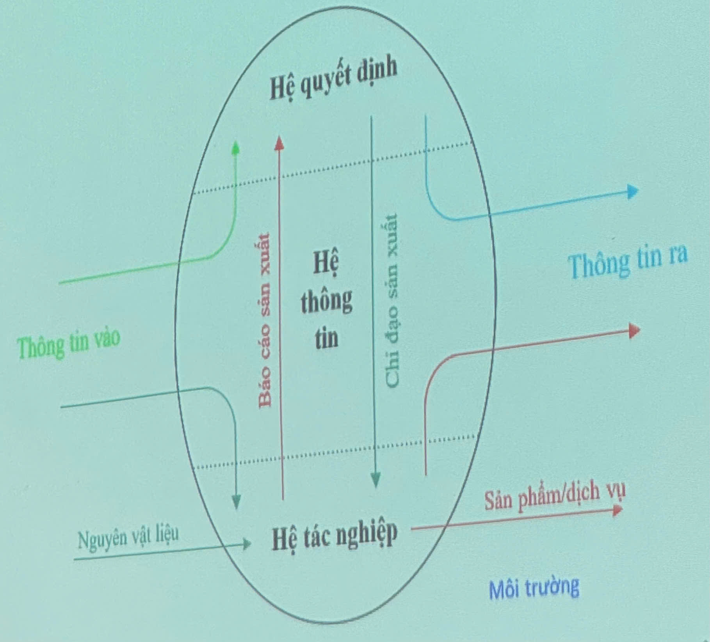
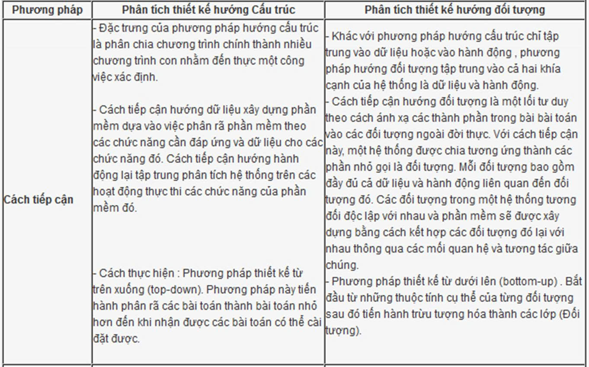
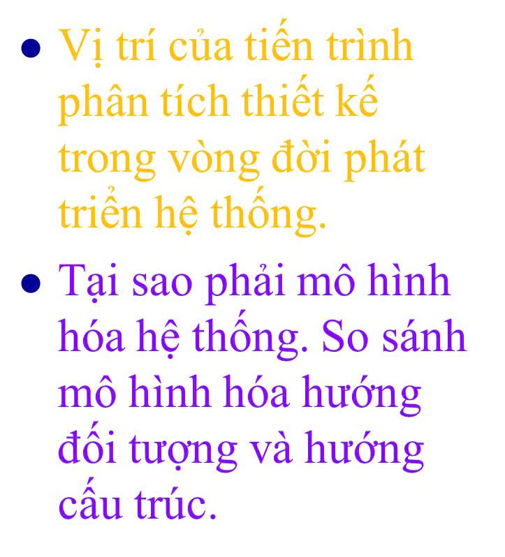

# Bài 1: Đại cương Phân tích & Thiết kế Hệ thống

### I. Hệ thống

#### 1. Khái niệm

- Là một tập hợp gồm nhiều phần tử:
- Có các mối quan hệ ràng buộc lẫn nhau.
- Cùng hoạt động hướng tới một mục đích chung.

#### 2. Đặc điểm

- Các phần tử thường đa dạng và phức tạp.
- Tồn tại nhiều loại mối quan hệ khác nhau giữa các phần tử.

---

### II. Hệ thống thông tin

#### 1. Khái niệm và đặc điểm

- **Chu trình sống (Lifecycle):** Bất kỳ hệ thống thông tin nào cũng trải qua một chu trình sống.
- **Các giai đoạn chính:**

1. Tìm hiểu nhu cầu
2. Phân tích
3. Thiết kế
4. Cài đặt
5. Khai thác và bảo dưỡng

> _Lưu ý:_ Quá trình này có thể diễn ra **tuyến tính** (tuần tự) hoặc **lặp lại** các giai đoạn.

#### 2. Sự hoạt động và mục đích

- **Mục đích:** Nhận đầu vào Biến đổi Tạo ra đầu ra.
- **Sự biến động** của hệ thống thể hiện qua hai mặt:
- _Sự tiến triển:_ Các thành phần có thể phát sinh, tăng trưởng, suy thoái hoặc mất đi.
- _Sự hoạt động:_ Các phần tử có mối ràng buộc, cùng cộng tác để thực hiện mục đích chung.

---

### III. Hệ thống Kinh doanh / Dịch vụ - Hệ con

#### 1. Khái niệm

Là hệ thống mà mục đích chính là thực hiện các hoạt động kinh doanh hoặc dịch vụ.

- **Kinh doanh:** Quan tâm đến **lợi nhuận** (Ví dụ: bán hàng, vật tư...).
- **Dịch vụ:** Quan tâm đến **lợi ích** (Ví dụ: trường học, bệnh viện...).

#### 2. Phân loại

- **Hệ thống kinh doanh** (Dựa vào hoạt động chính của doanh nghiệp):
- Công ty sản xuất và bán sản phẩm (_Production-oriented company_).
- Công ty cung cấp dịch vụ (_Service company_): Cung cấp thông tin, đại lý bán sản phẩm...
- Hãng dịch vụ Internet (_Internet dependent firm / .com_).

- **Hệ thống dịch vụ:** Trường học, bệnh viện, cơ quan hành chính, cơ quan công quyền.

#### 3. Quy mô và Cấu trúc

- **Quy mô:** Nhỏ, Vừa, Lớn.
- **Các thành phần trong doanh nghiệp:**
- _Công việc chính:_

1. Quản lý Tương ứng với **Hệ quản lý**.
2. Sản xuất Tương ứng với **Hệ tác nghiệp**.

- _Vấn đề trong quản lý:_

1. Thu thập và xử lý thông tin Tương ứng với **Hệ thông tin**.
2. Đưa ra quyết sách Tương ứng với **Hệ quyết định**.

---

### IV. Hệ thống thông tin

#### Hệ thống thông tin trong một tổ chức

\- là hệ thống có mục đích cung cấp thông tin phục vụ cho hoạt động của con người trong tổ chức đó

- Hệ thống quản lý nhân sự
- Hệ thống kế toán
- Hệ thống bán hàng
- Hệ thống quản lý vật tư...

#### Chức năng

\- Nhận thông tin vào
\- Xử lý dữ liệu
\- Lưu trữ các loại thông tin khác nhau
\- Đưa ra thông tin

#### Hệ thống thông tin dựa trên máy tính

\- CBD Computer Based System

- là một tập hợp các thành phần được tổ chức để thu thập, xử lý, lưu trữ, phân phối và biểu diễn thông tin, trợ giúp việc ra quyết định và kiểm soát hoạt động tỏng một tổ chức.

\- Cụ thể gồm

- Các thành phần được tổ chức
- Thực hiện các chức năng thông tin
- Trợ giúp cho tổ chức

\- Các thành phần

- Phần cứng (hardware)
- Phần mềm (software)
- Dữ liệu (data)
- Thủ tục, quy trình (process)
- Con người (people)

#### Hệ thống thông tin - Các thành phân

##### Phần cứng (hardware)

\- Là lớp vật lý của hệ thống thông tin

- Các máy tính
- Mạng, các thiết bị truyền thông
- ...

##### Phần mềm (software)

\- Phần mềm hệ thống (system software): điều khiển phần cứng và các phần mềm khác

- Hệ điều hành
- Phần mềm điều khiển thiết bị
- Các tiện ích xử lý: sao lưu, chống virus, dọn dẹp ổ,....

\- Phần mềm ứng dụng (application software): chương trình xử lý dữ liệu tạo ra thông tin

- Thực hiện các chức năng nghiệp vụ
- Ứng dụng do doanh nghiệp thực hiện
- Gói sản phẩm phần mềm mua từ nhà cung cấp

##### Dữ liệu

\- Chứa trong các tập tin và CSDL
\- Bao gồm: Dữ liệu cấu trúc nội tại, Dữ liệu hoạt động

##### Quy tắc, quy trình xử lý

\- **Quy tắc quản lý**: quy định, mẫu biểu, báo cáo, thống kê
\- **Quy trình xử lý**: quy trình nhân viên thực hiện công việc, nghiệp vụ

- Xử lý: hoạt động **tác động lên dữ liệu** làm nó biển đổi
- Quy trình xử lý trên máy tính: theo lô, tương tác, trực tuyến, thời gian thực, phân tác

##### Con người

\- Người sử dụng hệ thống, người dùng cuối (end-user), người cho / nhận thông tin với hệ thống

\- Người sử dụng bên trong **hệ thống** (internal user)

- Quản lý, kỹ thuật viên, nhân viên...

\- Người sử dụng bên ngoài

- Khách hàng, nhà cung cấp
- Những người khác tương tác với hệ thống

### V. Hệ thống thông tin - Phân loại

##### Theo lĩnh vực và nghiệp vụ

\- Hệ thống tự động văn phong (Office Automation System - OAS)
\- Hệ thống truyền thông (Communication System - CS)
\- Hệ thống thông tin thực hiện (Executive Information System - EIS)
\- Hệ thống xử lý giao dịch (Transaction Processing System - TPS)
\- Hệ thống tin quản lý (Management IS - MIS)

##### Theo lĩnh vực nghiệp vụ

\- Hệ hỗ trợ giúp quyết định (Decision Support System - DSS)
\- Hệ chuyên gia (Expert System - ES)
\- Hệ trợ giúp điều hành (Execution Support System - ESS)
\- Hệ trợ giúp làm việc nhóm (Groupware System - GS)
\- Hệ kiến thực làm việc (Knowledge Work System - KWS)

##### Theo quy mô kỹ thuật

\- Hệ thông tin cá nhân (Personal Information System)
\- Hệ thông tin làm việc (WorkGroup Information Systems)
\- Hệ thông tin doanh nghiệp (Enterprise Information Systems)

##### Theo đặc tính kỹ thuật

\- Hệ thông thường (General Systems)
\- Hệ thống thời gian thực (Real Time Systems)
\- Hệ thống nhúng (Embedded Systems)

### VI. Tích hợp các hệ thống thông tin

#### Các công nghệ mới

##### Được tích hợp trong hệ thống thông tin truyền thốn

\- Thương mại điện tử (Ecommerce)
\- Hoạch định nguồn lực doanh nghiệp (Enterprise Resource Planning)
\- ....

##### Phát triển hệ thống thông tin trong tổ chức

\- Tại sao tổ chức cần phát triển hệ thống thông tin

- Khắc phục hạn chế, khó khăn cản trở đạt mục tiêu hiện tại
- Tạo ưu thế vượt qua thách thức và tận dụng cơ hội trong tương lai
- Để hợp tác với đối tác

\- Ba nhân tố chính

- Các hoạt động, trình tự phát triển hệ thống thông tin (phương pháp luận)
- Các phương pháp, công nghệ và công cụ sử dụng
- Tổ chức và quản lý qus trình phát triển

\-

#### Phương pháp luận

\- Tiếp cận hướng cấu trúc

- Làm giảm sự phức tạp
- Tập trung vào ý tưởng
- Chuẩn mực hóa tiến trình
- Hướng về tương lai (kiến trúc)
- Giảm tính nghệ thuật trong thiết kế

\- Tiếp cận hướng đối tượng

- Lợi ích
  - Khả năng sử dụng lại cao
  - Cho phép phát triển hệ có quy mô tùy ý bằng lắp ghép
  - Bảo trì thuận lợi

## BÀI TẬP

## 
